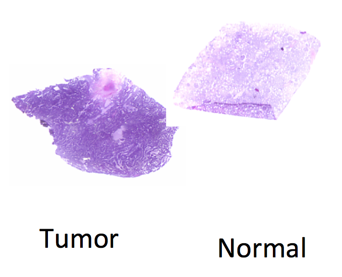
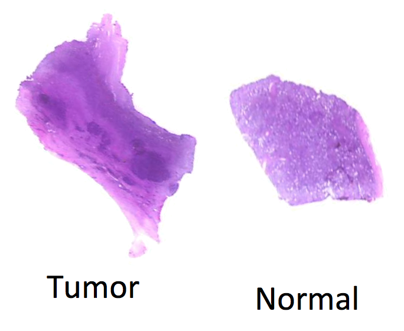
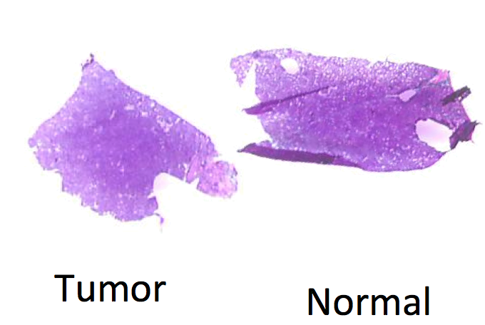
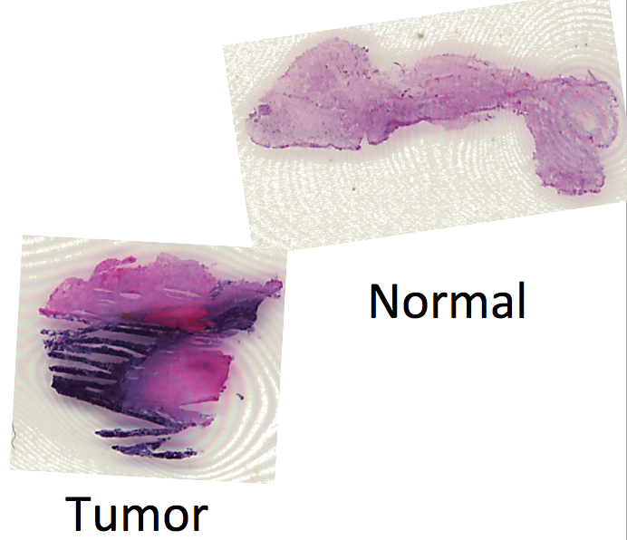
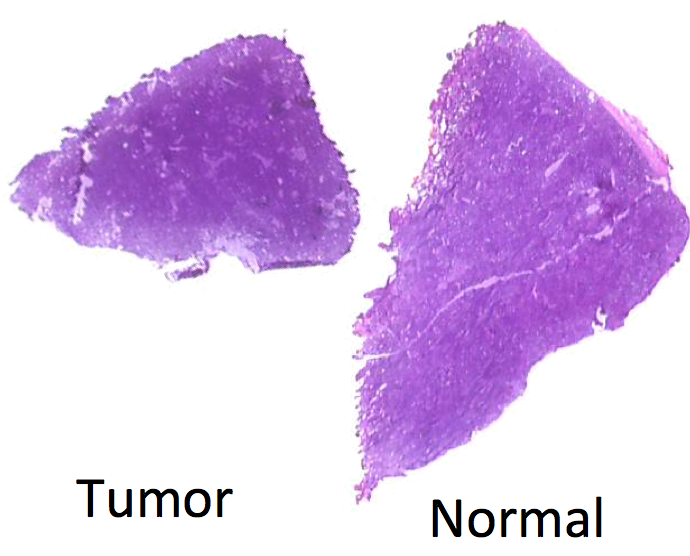
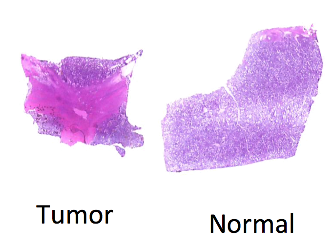
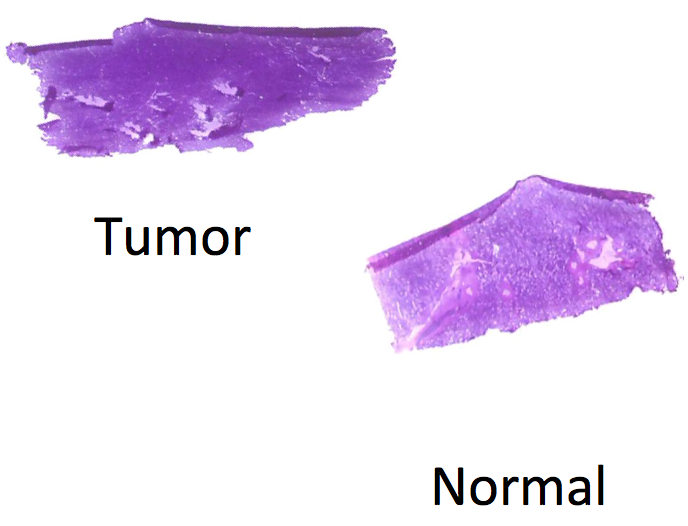
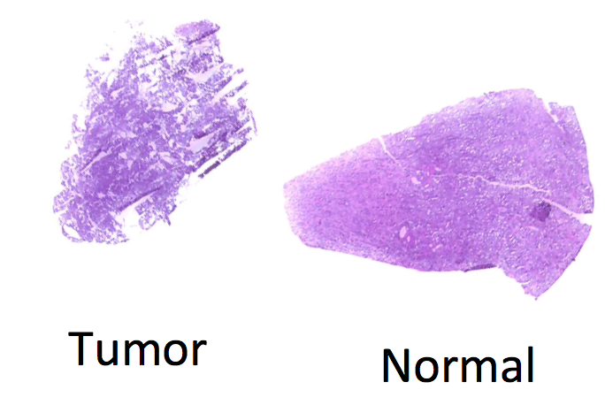

  
```{r style, echo=FALSE, results='asis'}
BiocStyle::markdown()
```

```{r setup, echo=FALSE, message=FALSE}
library(Cardinal)
setCardinalVerbose(FALSE)
```

# Introduction 

For experiments in which analyzed samples come from different classes or conditions, a common goal of supervised analysis is classification: given a labeled training set for which classes are already known, we want to predict the class of a new sample.

Unlike unsupervised analysis such as segmentation, classification requires biological replicates for testing and validation, to avoid biased reporting of accuracy. *Cardinal* provides cross-validation for this purpose.

In this vignette, we present an example classification workflow using *Cardinal*.

We begin by loading the package:

```{r library, eval=FALSE}
library(Cardinal)
```


# Classification of a renal cell carcinoma (RCC) cancer dataset

This example uses DESI spectra collected from a renal cell carcinoma (RCC) cancer dataset consisting of 8 matched pairs of human kidney tissue. Each tissue pair consists of a normal tissue sample and a cancerous tissue sample. The goal of the workflow is to develop classifiers for predicting whether a new tissue sample is normal or cancer.

MH0204_33 | UH0505_12 | UH0710_33 | UH9610_15
--------- | --------- | --------- | ---------
 |  |  | 

UH9812_03 | UH9905_18 | UH9911_05 | UH9912_01
--------- | --------- | --------- | ---------
 |  |  | 

In this RCC dataset, we expect that normal tissue and cancerous tissue will have unique chemical profiles, which we can use to classify new tissue based on the mass spectra.

First, we load the dataset from the *CardinalWorkflows* package using `exampleMSIData()`.

```{r load-rcc}
rcc <- CardinalWorkflows::exampleMSIData("rcc")
```

The dataset contains 16,000 spectra with 10,200 *m/z*-values.

```{r show-rcc}
rcc
```

We can visualize the diagnoses:

```{r rcc-diagnosis}
image(rcc, "diagnosis", layout=c(2,4), free="xy", col=dpal("Set1"))
```

As can be seen above, each matched pair of tissues belonging to the same subject are on the same slide (i.e., the same run). Note also the the cancer tissue is on the left and the normal tissue is on the right on each slide.


## Pre-processing

First, let's visualize the total ion current.

```{r rcc-tic}
rcc <- summarizePixels(rcc, stat=c(TIC="sum"))
```

```{r plot-cardinal-tic}
image(rcc, "TIC", layout=c(2,4), free="xy")
```

Clearly there is pixel-to-pixel variation in in the total ion current.

We will normalize the TIC and perform peak picking on all spectra.

```{r rcc-peak-pick}
rcc_peaks <- rcc |>
	normalize(method="tic") |>
	peakProcess(SNR=3, filterFreq=FALSE,
		tolerance=0.5, units="mz")

rcc_peaks
```

This produces a centroided dataset with 753 peaks.

Note that we have performed peak picking on all spectra, rather than peak picking on a subset and then summarizing (as we did in the "Segmentation" workflow). This is so we have independent peaks for every spectrum that were not selected based on information from any other spectra. Therefore, we can use these peaks in cross-validation (after re-aligning them independently within each training set).

We will also create a subset of the dataset that excludes the background pixels.

```{r rcc-subset}
rcc_nobg <- subsetPixels(rcc_peaks, !is.na(diagnosis))
rcc_nobg
```


## Visualization

Before proceeding with the statistical analysis, we'll first perform some exploratory visual analysis of the dataset.

### Ion images

Let's plot the images for *m/z* 810, which appears abundant in both normal and tumor tissue, and doesn't seem to be very predictive.

```{r mz-810}
image(rcc_peaks, mz=810.36, layout=c(2,4), free="xy",
	smooth="bilateral", enhance="histogram", scale=TRUE)
```

We will also visualize *m/z* 855, which appears slightly more abundant in the tumor tissue (left).

```{r mz-886}
image(rcc_peaks, mz=886.43, layout=c(2,4), free="xy",
	smooth="bilateral", enhance="histogram", scale=TRUE)
```

Lastly, we will also visualize *m/z* 215, which appears more abundant in the normal tissue (right).

```{r mz-215}
image(rcc_peaks, mz=215.24, layout=c(2,4), free="xy",
	smooth="bilateral", enhance="histogram", scale=TRUE)
```

We can also note that runs "UH0505_12" and "UH9905_18" have very heterogenous tumor tissues, with what appear to be large sections of normal tissue.


### Principal components analysis (PCA)

Principal component analysis (PCA) is an unsupervised method for exploring a dataset. PCA is available in *Cardinal* through the `PCA()` method.

Below, we calculate the first 2 principal components. Note that PCA does not use any information about the diagnosis.

```{r rcc-pca}
rcc_pca <- PCA(rcc_nobg, ncomp=2)
```

We can overlay the PC scores of the first 2 principal components. It doesn't appear that either component distinguishes the diagnoses.

```{r pca-image}
image(rcc_pca, type="x", layout=c(2,4), free="xy", scale=TRUE)
```

We can plot the scores of the first 2 components against each other to see how they separate the diagnoses (or don't, in this case).

```{r pca-scores-diagnosis}
plot(rcc_pca, type="x", groups=rcc_nobg$diagnosis, shape=20)
```

It doesn't appear that PCA separates cancer versus normal tissue. At least, not the first 2 components.

PCA is also a useful way to visualize how much each run clusters together. A large amount of variation in the data tends to be variation between experimental runs. This is why it's useful to have matched pairs on the same slide.

```{r pca-scores-run}
plot(rcc_pca, type="x", groups=run(rcc_nobg), shape=20)
```


### Non-negative matrix factorization (NMF)

Non-negative matrix factorization (NMF) is a popular alternative to PCA. It is similar to PCA, but produces non-negative loadings, which can make it easier to interpret and more suited to spectral data. NMF is available in *Cardinal* through the `NMF()` method.

Below, we calculate the first 2 NMF components. Like PCA, NMF does not use any information about the diagnosis.

```{r rcc-nmf}
rcc_nmf <- NMF(rcc_nobg, ncomp=2, niter=5)
```

We can overlay the scores of the first 2 NMF components. It looks like the 1st component correlates to tumor and the 2nd component correlates to normal.

```{r nmf-image}
image(rcc_nmf, type="x", layout=c(2,4), free="xy", scale=TRUE)
```

We can plot the scores of the first 2 components against each other to see how they separate the diagnoses (or don't, in this case).

```{r nmf-scores-diagnosis}
plot(rcc_nmf, type="x", groups=rcc_nobg$diagnosis, shape=20)
```

It looks like there is still quite a lot of overlap between tumor and normal in NMF components.

Lastly, we'll also visualize how the NMF components relate to the runs.

```{r nmf-scores-run}
plot(rcc_nmf, type="x", groups=run(rcc_nobg), shape=20)
```


## Classification with spatial shrunken centroids (SSC)

To classify the dataset and automatically select peaks that distinguish each class, we will use the `spatialShrunkenCentroids()` method provided by *Cardinal*.

Important parameters to this method include:

- `weights` The type of spatial weights to use:
	
	+ *"gaussian"* weights use a simple Gaussian smoothing kernel
	
	+ *"adaptive"* weights use an adaptive kernel that sometimes preserve edges better

- `r` The neighborhood smoothing radius; this should be selected based on the size and granularity of the spatial regions in your dataset

- `s` The shrinkage or sparsity parameter; the higher this number, the fewer peaks will be used to determine the classification.


### Cross-validation with SSC

In order to avoid over-fitting due to the pre-processing, spectra from each CV fold must be processed independently. We have already performed peak picking independently on every spectrum.

Therefore, for each CV fold, we will re-align the peaks in the pooled training set (so the alignment does not use any peaks from the test set), and then re-align the peaks in the test set to the aligned peaks in the training set.

We use the `crossValidate()` method to perform the processing and cross-validation, treating each run as a separate fold. The `trainProcess()` and `testProcess()` arguments can be used to control the pre-processing for each fold. The default processing (`peakpProcess`) will work for our situation.

```{r rcc-cv}
rcc_ssc_cv <- crossValidate(spatialShrunkenCentroids,
	x=rcc_nobg, y=rcc_nobg$diagnosis, r=1, s=2^(1:5),
	folds=run(rcc_nobg))

rcc_ssc_cv
```

It appears `s=16` produces the best balanced accuracy of ~93% (reported above as the macro-averaged recall).


### Plotting the classified images

Now we plot the classified images from each of the cross-validation folds. We plot the fold predictions for the "best" model `s=16` (`i=4`).

```{r rcc-ssc-image}
image(rcc_ssc_cv, i=4, layout=c(2,4), free="xy", col=dpal("Set1"))
```

Opacity is used to reflect the probability of class membership. The classifier appears to do a good job distinguishing between tumor and normal tissue.


### Plotting the (shrunken) mean spectra

To interpret the model's parameters, we can re-fit the best model to the whole dataset.

```{r rcc-ssc-best}
rcc_ssc1 <- spatialShrunkenCentroids(rcc_nobg,
	y=rcc_nobg$diagnosis, r=1, s=16)

rcc_ssc1
```

Now, we plot the centroids for each class separately.

```{r rcc-ssc-mean}
plot(rcc_ssc1, type="centers", linewidth=2)
```

It is difficult to tell just from the mean spectra what peaks distinguish each diagnosis.


### Plotting and interpretting t-statistics of the *m/z* values

Plotting the t-statistics tells us exactly the relationship between each class's centroid and the global mean spectrum. The t-statistics are the difference between a class's centroid and the global mean, divided by a standard error.

Positive t-statistics indicate that peak is systematically higher intensity in that class relative to the (global) mean spectrum.

Negative t-statistics indicate that peak is systematically lower intensity in that class relative to the (global) mean spectrum.

Due to the sparsity parameter `s`, unimportant peaks will have a t-statistic of 0 and will effectively have no effect on the classification.

```{r rcc-statistic}
plot(rcc_ssc1, type="statistic", linewidth=2)
```

This lets us clearly see which peaks are distinguishing tumor versus normal tissue.


### Retrieving the top *m/z*-values

We can use  the `topFeatures()` method to retrive the *m/z* values associated with each class.

```{r top-features}
rcc_ssc_top <- topFeatures(rcc_ssc1)
```

Let's find the *m/z* values associated with tumor tissue.

```{r top-cancer}
subset(rcc_ssc_top, class=="cancer")
```

```{r top-mz-886}
image(rcc_peaks, mz=886.4, layout=c(2,4), free="xy",
	smooth="bilateral", enhance="histogram", scale=TRUE)
```

And let's find the *m/z* values associated with normal tissue.

```{r top-normal}
subset(rcc_ssc_top, class=="normal")
```

```{r top-mz-215}
image(rcc_peaks, mz=215.24, layout=c(2,4), free="xy",
	smooth="bilateral", enhance="histogram", scale=TRUE)
```


# Multiple instance learning (MIL)


In practice, tumor tissue is often heterogenous. Rather than being entirely cancerous, what we label as "tumor" tissue will typically include some regions of healthy "normal" tissue as well.

However, due to time constraints, pathologists will often label entire tissue sections as "tumor" or "normal" rather than annotating region-by-region within a tissue. Therefore, we do not typically have access to sub-tissue labels for training.

Instead, we usually only have whole-tissue labels, so mass spectra that may (correctly) indicate "normal" tissue may be mislabeled as "tumor" in our training (and testing!) data.

Multiple instance learning (MIL) is a technique that can iteratively re-fit classification models to try to account for this uncertainty in the class labels. MIL assumes that the data consists of multiple instances (pixels/spectra in our case) that belong to "bags" (e.g., tissue samples), and the class labels are only observed at the "bag"-level.

We now perform classification with multiple instance learning.


## Preparing the samples (bags)

We need to create a factor specifying the 16 tissue samples.

Rather than rely on the manual region-of-interest selection, we will rely on the fact that cancer tissue is on the left and the normal tissue is on the right on each slide.

```{r rcc-split}
x_threshold <- c(35, 23, 28, 39, 29, 28, 47, 32)

rcc_peaks$rough_diagnosis <- factor("normal", levels=c("cancer", "normal"))

for ( i in seq_len(nrun(rcc_peaks)) ) {
	irun <- run(rcc_peaks) == runNames(rcc_peaks)[i]
	j <- irun & coord(rcc_peaks)$x < x_threshold[i]
	pData(rcc_peaks)$rough_diagnosis[j] <- "cancer"
}

rcc_peaks$samples <- interaction(run(rcc_peaks), rcc_peaks$rough_diagnosis)
```

We want to check the samples to make sure the diagnosis labels are homogenous within each sample.

```{r rcc-check}
tapply(rcc_peaks$diagnosis, rcc_peaks$samples,
	function(cond) unique(as.character(cond)[!is.na(cond)]))
```

Since MIL requires re-training the model multiple times, it can be time-consuming, so we will reduce the number of folds (so fewer models need to be trained).

We will create 2 custom folds for the cross-validation. The 1st fold will consist of runs 1-4 and the 2nd fold will consist of runs 5-8.

```{r rcc-folds}
fold1 <- run(rcc_peaks) %in% runNames(rcc_peaks)[1:4]

rcc_peaks$folds <- factor(ifelse(fold1, "fold1", "fold2"))
```

## Cross-validation with MIL

Finally, we will perform cross-validation with multiple instance learning by passing the tissue samples as the `bags`.

```{r rcc-mi}
rcc_ssc_cvmi <- crossValidate(spatialShrunkenCentroids,
	x=rcc_peaks, y=rcc_peaks$diagnosis, r=1, s=2^(1:4),
	folds=rcc_peaks$folds, bags=rcc_peaks$samples)

rcc_ssc_cvmi
```

In this case, the accuracy is not quite as high as before, but the diagnosis labels we are using have already been selected to include only the cancerous regions instead of the whole tissues.

If we did *not* have the sub-tissue labels, then this approach would likely improve real-world performance.

```{r rcc-mi-image}
image(rcc_ssc_cvmi, i=3, layout=c(2,4), free="xy", col=dpal("Set1"),
	subset=!is.na(rcc_peaks$diagnosis))
```


# Additional notes on cross-validation

Because we used a matched pairs experiment, with one subject per run, it was straightforward to treat the experimental runs as our CV folds. However, it does not always work out this way. When using multiple instance learning, we set up custom CV folds to reduce the total number of models we needed to train.

In general, a CV fold needs to include examples of both positive and negative classes. In addition, spectra from the same sample should not be split across multiple CV folds. In MS imaging, it is important to remember that the sample size *does NOT* equal the number of spectra or the number of pixels, but the number of independent tissue samples.


# Session information

```{r session-info}
sessionInfo()
```


