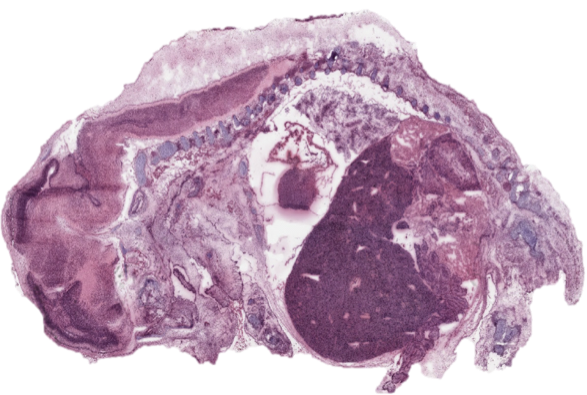

```{r style, echo=FALSE, results='asis'}
BiocStyle::markdown()
```

```{r setup, echo=FALSE, message=FALSE}
library(Cardinal)
setCardinalVerbose(FALSE)
```

# Introduction 

The goal of unsupervised analysis of mass spectrometry (MS) imaging experiments is to discover regions in the data with distinct chemical profiles, and to select the *m/z* values that uniquely distinguish these different regions from each other.

Algorithmically, this means clustering the data. In imaging experiments, the resulting cluster configurations are called spatial segmentations, and the clusters are called segments.

In this vignette, we present an example segmentation workflow using *Cardinal*.

We begin by loading the package:

```{r library, eval=FALSE}
library(Cardinal)
```


# Segmentation of a pig fetus wholy body cross section

This example uses the PIGII_206 dataset: a cross section of a pig fetus captured using a Thermo LTQ instrument using desorption electrospray ionization (DESI).

First, we load the dataset from the *CardinalWorkflows* package using `exampleMSIData()`.

```{r load-pig206}
pig206 <- CardinalWorkflows::exampleMSIData("pig206")
```

The dataset contains 4,959 spectra with 10,200 *m/z* values.

```{r show-pig206}
pig206
```



In the optical image shown above, the brain (left), heart (center), and liver (large dark region) are clearly visible.

```{r mz-885}
image(pig206, mz=885.5, tolerance=0.5, units="mz")
```

The dataset has been cropped to remove the background slide pixels, leaving only the tissue section itself for analysis.


## Pre-processing

For statistical analysis, it is useful to reduce the dataset to include only the peaks.

We calculate the mean spectrum using `summarizeFeatures()`.

```{r pig206-mean}
pig206 <- summarizeFeatures(pig206, c(Mean="mean"))
```

```{r plot-pig206-mean}
plot(pig206, "Mean", xlab="m/z", ylab="Intensity")
```

In order to make the mass spectra comparable between different pixels, it is necessary to normalize the data. We will use TIC normalization.

Let's calculate the TIC to see how it currently varies across the dataset in the raw, unprocessed specra.

```{r pig206-tic}
pig206 <- summarizePixels(pig206, c(TIC="sum"))
```

```{r plot-pig206-tic}
image(pig206, "TIC")
```

To process the dataset, we will use `peakProcess()` to perform peak picking on a subset of the mass spectra, and then use these as a reference to summarize the peaks in every mass spectrum in the dataset.

We use `sampleSize=0.1` to indicate we want to perform peak picking on 10% of spectra to create the reference peaks. `SNR=3` indicates the signal-to-noise ratio threshold to peak detection. And `tolerance=0.5` indicates the minimum distance between peaks. (Peaks closer together than this are merged.)

```{r peak-process}
pig206_peaks <- pig206 |>
	normalize(method="tic") |>
	peakProcess(SNR=3, sampleSize=0.1,
		tolerance=0.5, units="mz")

pig206_peaks
```

This produces a centroided dataset with 687 peaks.


## Visualization

Before proceeding with the statistical analysis, we'll first perform some and exploratory visual analysis of the dataset.

### Ion images

Below, we plot several hand-selected peaks corresponding to major organs.

*m/z* 187 appears highly abundant in the heart.

```{r mz-187}
image(pig206_peaks, mz=187.36)
```

*m/z* 840 appears highly abundant in the brain and spinal cord.

```{r mz-840}
image(pig206_peaks, mz=840.43)
```

*m/z* 537 appears highly abundant in the liver.

```{r mz-537}
image(pig206_peaks, mz=537.08)
```

Rather than manually going the full dataset and hand-selecting peaks, the goal of our statistical analysis will be to automatically select the peaks that distinguish such regions (e.g., the major organs).

### Principal components analysis (PCA)

Principal component analysis (PCA) is a popular method for exploring a dataset. PCA is available in *Cardinal* through the `PCA()` method.

Below, we calculate the first 3 principal components.

```{r}
pig206_pca <- PCA(pig206_peaks, ncomp=3)

pig206_pca
```

Next, we overlay the first 3 principal components.

```{r}
image(pig206_pca, smooth="adaptive", enhance="histogram")
```

We can plot the loadings for the principal components as well.

```{r}
plot(pig206_pca, linewidth=2)
```

PCA can sometimes be useful for exploring a dataset. For example, here, we can see that PC3 appears to distinguish the liver, but also includes other structures. This makes it difficult to fully utilize PCA for analysis.


### Non-negative matrix factorization (NMF)

Non-negative matrix factorization (NMF) is a popular alternative to PCA. It is similar to PCA, but produces non-negative loadings, which can make it easier to interpret and more suited to spectral data. NMF is available in *Cardinal* through the `NMF()` method.

Below, we calculate the first 3 NMF components.

```{r}
pig206_nmf <- NMF(pig206_peaks, ncomp=3, niter=30)

pig206_nmf
```

Next, we overlay the first 3 NMF components.

```{r}
image(pig206_nmf, smooth="adaptive", enhance="histogram")
```

We can plot the loadings for the NMF components as well.

```{r}
plot(pig206_nmf, linewidth=2)
```

NMF seems to distinguish the morphology better than PCA in this case.


## Segmentation with spatial shrunken centroids (SSC)

To segment the dataset and automatically select peaks that distinguish each region, we will use the `spatialShrunkenCentroids()` method provided by *Cardinal*.

Important parameters to this method include:

- `weights` The type of spatial weights to use:
	
	+ *"gaussian"* weights use a simple Gaussian smoothing kernel
	
	+ *"adaptive"* weights use an adaptive kernel that sometimes preserve edges better

- `r` The neighborhood smoothing radius; this should be selected based on the size and granularity of the spatial regions in your dataset

- `k` The maximum number of segments to try; empty segments are dropped, so the resulting segmentation may use fewer than this number.

- `s` The shrinkage or sparsity parameter; the higher this number, the fewer peaks will be used to determine the final segmentation.

It can be usefel to set `k` relatively high and let the algorithm drop empty segments. You typically want to try a wide range of sparsity with the `s` parameter.

```{r ssc}
set.seed(1)
pig206_ssc <- spatialShrunkenCentroids(pig206_peaks,
	weights="adaptive", r=2, k=8, s=2^(1:6))

pig206_ssc
```

This produces a `ResultsList` of the 6 fitted models.

As shown in the metadata columns, the number of resulting segments (`clusters`) is fewer for higher values of `s`. This is because fewer peaks are used to determine the segmentation.

Larger values of `s` will remove non-informative peaks, but very large values of `s` may remove meaningful peaks too. For very large values of `s`, morphological structures will begin to disappear from the segmentation. The most interesting and useful segmentations tend to be the ones with the highest value of `s` that still show meaningful morphology.

We can also look at the `AIC` and `BIC` values to help guide our choice of what segmentation to explore further. Smaller values are better, but small differences become less meaningful.

In this case, the last 3 models (`s=16`, `s=32`, and `s=64`) all seem to be much better from the previous models, but are not significantly different from each other based on AIC. Based on BIC, the last two models seem to be the best. However, the models for `s=16` and `s=32` support 7-8 segments, while the model for `s=64` only supports 3 segments.


### Plotting the segmentation

Let's plot the 4 most sparse segmentations.

```{r ssc-image-multi}
image(pig206_ssc, i=3:6)
```

It is useful to see how the segmentation changes as fewer peaks are used and the number of segments decreases. Noisy, less-meaningful segments tend to be removed first, so we want to explore the segmentation with the highest value of `s` that still captures the morphology we would expect to see. At `s=64`, the heart segment is lost. We will choose the most sparse segmentation that still includes the heart.

```{r ssc-image-best}
pig206_ssc1 <- pig206_ssc[[5]]

image(pig206_ssc1)
```

Note that the translucent colors that don't appear to belong to any segment indicate areas of low probability (i.e., high uncertainty in the segmentation).

We can plot the segment assignments instead of the probabilities to see the exact segmentation.

```{r ssc-image-class}
image(pig206_ssc1, type="class")
```

Here, we can see the heart, liver, and brain distinguished as segments 2, 6, and 7.


### Plotting the (shrunken) mean spectra

Plotting the shrunken centroids is analogous to plotting the mean spectrum of each segment.

```{r ssc-centers}
plot(pig206_ssc1, type="centers", linewidth=2)
```

Let's break out the centroids for the heart, liver, and brain segments (2, 6, and 7).

```{r ssc-centers-2}
plot(pig206_ssc1, type="centers", linewidth=2,
	select=c(2,6,7), superpose=FALSE, layout=c(1,3))
```

Some differences are visible, but it can be difficult to tell exactly which peaks are changing between different segments based on the (shrunken) mean spectra alone.


### Plotting and interpretting t-statistics of the *m/z* values

Plotting the t-statistics tells us exactly the relationship between each segment's centroid and the global mean spectrum. The t-statistics are the difference between a segment's centroid and the global mean, divided by a standard error.

Positive t-statistics indicate that peak is systematically higher intensity in that segment relative to the (global) mean spectrum.

Negative t-statistics indicate that peak is systematically lower intensity in that segment relative to the (global) mean spectrum.

Spatial shrunken centroids works by shrinking these t-statistics toward 0 by `s`, and using the new t-statistics to recompute the segment centroids. The effect is that peaks that are not very different between a specific segment and the global mean are effectively eliminated from the segmentation.

```{r ssc-statistic}
plot(pig206_ssc1, type="statistic", linewidth=2)
```

If we break out the t-statistics for the heart, liver, and brain segments we can learn something interesting.

```{r ssc-statistic-2}
plot(pig206_ssc1, type="statistic", linewidth=2,
	select=c(2,6,7), superpose=FALSE, layout=c(1,3))
```

Very few peaks distinguish the heart (segment 2), while many more distinguish the liver and brain (segments 6 and 7).


### Retrieving the top *m/z* values

Use the `topFeatures()` method to extract the *m/z* values of the peaks that most distinguish each segment, ranked by t-statistic.

```{r top-ssc}
pig206_ssc_top <- topFeatures(pig206_ssc1)
```

Peaks associated with the heart:

```{r top-heart}
subset(pig206_ssc_top, class==2 & statistic > 0)
```

Peaks associated with the liver:

```{r top-liver}
subset(pig206_ssc_top, class==6 & statistic > 0)
```

Peaks associated with the brain:

```{r top-brain}
subset(pig206_ssc_top, class==7 & statistic > 0)
```

The top *m/z* values for each segment match up well with the hand-selected peaks.


# Segmentation of a cardinal painting

It can be difficult to evaluate unsupervised methods (like segmentation) on data where we do not know the ground truth.

In this section, we use an MS image of a painting, where we know the ground truth.

```{r load-cardinal}
cardinal <- CardinalWorkflows::exampleMSIData("cardinal")
```


In this experiment, DESI spectra were collected from an oil painting of a cardinal.

```{r show-cardinal}
cardinal
```

The dataset includes 12,600 spectra with 10,800 *m/z* values.

## Pre-processing

We will begin by visualizing the mean spectrum as before.

```{r cardinal-mean}
cardinal <- summarizeFeatures(cardinal, c(Mean="mean"))
```

```{r plot-cardinal-mean}
plot(cardinal, "Mean", xlab="m/z", ylab="Intensity")
```

And the total ion current.

```{r cardinal-tic}
cardinal <- summarizePixels(cardinal, c(TIC="sum"))
```

```{r plot-cardinal-tic}
image(cardinal, "TIC")
```

We will pre-process the dataset as before, by applying peak picking to 10% of the spectra and then summarizing these peaks for every spectrum.

```{r cardinal-process}
cardinal_peaks <- cardinal |>
	normalize(method="tic") |>
	peakProcess(SNR=3, sampleSize=0.1,
		tolerance=0.5, units="mz")

cardinal_peaks
```

This results in a centroided dataset with 929 peaks.

## Segmentation with SSC

Now we use spatial shrunken centroids to segment the dataset.

```{r ssc-cardinal}
set.seed(1)
cardinal_ssc <- spatialShrunkenCentroids(cardinal_peaks,
	weights="adaptive", r=2, k=8, s=2^(1:6))

cardinal_ssc
```

```{r ssc-cardinal-multi}
image(cardinal_ssc, i=2:5)
```

We can see increasing higher sparsities result in lose the "wing" segment, so we will choose the most sparse segmentation that retains the cardinal's wings.

Now we can use the segmentation to re-construct the original painting.

```{r ssc-cardinal-image}
cardinal_ssc1 <- cardinal_ssc[[4]]

pal <- c("1"="gray", "2"=NA, "3"="brown", "4"="red",
	"5"=NA, "6"="darkred", "7"="black", "8"="firebrick")

image(cardinal_ssc1, col=pal)
```

Let's find the *m/z* values associated with the cardinal's body.

```{r top-body}
cardinal_ssc_top <- topFeatures(cardinal_ssc1)

subset(cardinal_ssc_top, class==4)

image(cardinal_peaks, mz=207.05, smooth="guided", enhance="histogram")
```

And let's find the *m/z* values associated with the "DESI-MS" text.

```{r top-text}
subset(cardinal_ssc_top, class==6)

image(cardinal_peaks, mz=648.99, smooth="guided", enhance="histogram")
```


# Session information

```{r session-info}
sessionInfo()
```


