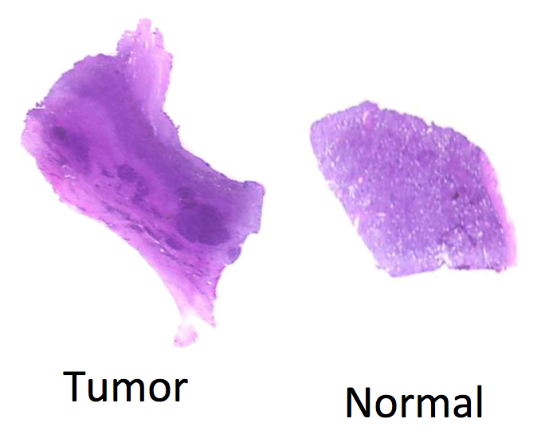
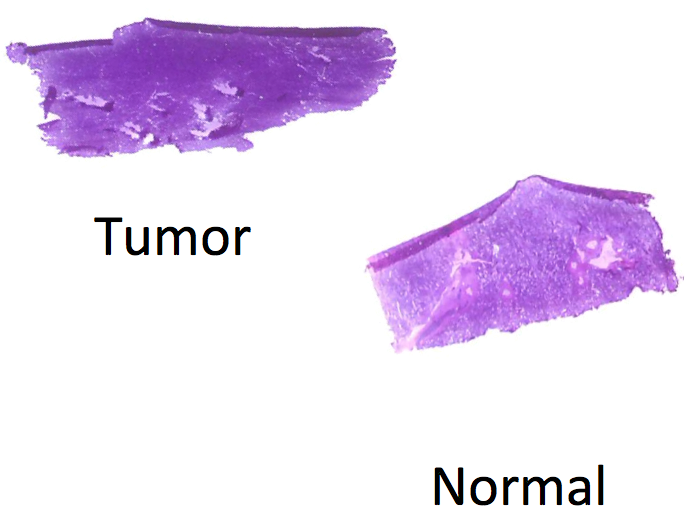

  
```{r style, echo=FALSE, results='asis'}
BiocStyle::markdown()
```

```{r setup, echo=FALSE, message=FALSE}
library(Cardinal)
setCardinalVerbose(FALSE)
```

# Introduction 

For experiments in which analyzed samples come from different classes or conditions, a common goal of statistical analysis is class comparison via hypothesis testing.

Statistical testing is performed to find peaks that are differentially abundant among different classes or conditions.

Valid statistical testing requires biological replicates in order to compare between different conditions. It should never be performed with less than 3 samples per condition.

In this vignette, we present an example class comparison workflow using *Cardinal*.

We begin by loading the package:

```{r library, eval=FALSE}
library(Cardinal)
```

# Statistical testing for a renal cell carcinoma (RCC) cancer dataset

This example uses DESI spectra collected from a renal cell carcinoma (RCC) cancer dataset consisting of 8 matched pairs of human kidney tissue. Each tissue pair consists of a normal tissue sample and a cancerous tissue sample.

MH0204_33 | UH0505_12 | UH0710_33 | UH9610_15
--------- | --------- | --------- | ---------
 |  |  | 

UH9812_03 | UH9905_18 | UH9911_05 | UH9912_01
--------- | --------- | --------- | ---------
 |  |  | 

For the RCC cancer dataset, the goal is to find m/z features differentially abundant between normal and cancer tissue.

First, we load the dataset from the *CardinalWorkflows* package using `exampleMSIData()`.

```{r load-rcc}
rcc <- CardinalWorkflows::exampleMSIData("rcc")
```

The dataset contains 16,000 spectra with 10,200 *m/z*-values.

```{r show-rcc}
rcc
```

We can visualize the diagnoses:

```{r rcc-diagnosis}
image(rcc, "diagnosis", layout=c(2,4), free="xy", col=dpal("Set1"))
```

As can be seen above, each matched pair of tissues belonging to the same subject are on the same slide (i.e., the same run). Note also the the cancer tissue is on the left and the normal tissue is on the right on each slide.

## Pre-processing

First, let's visualize the total ion current.

```{r rcc-tic}
rcc <- summarizePixels(rcc, stat=c(TIC="sum"))
```

```{r plot-cardinal-tic}
image(rcc, "TIC", layout=c(2,4), free="xy")
```

Clearly there is pixel-to-pixel variation in in the total ion current.

We will normalize the TIC, perform peak picking on a sample of 10% of all mass spectra to create a set of reference peaks, and then summarize these reference peaks in every spectrum.

```{r rcc-peak-pick}
rcc_peaks <- rcc |>
	normalize(method="tic") |>
	peakProcess(SNR=3, sampleSize=0.1, filterFreq=0.2,
		tolerance=0.5, units="mz")

rcc_peaks
```

Rather than rely on the manual region-of-interest selection, we will rely on the fact that cancer tissue is on the left and the normal tissue is on the right on each slide.

```{r rcc-split}
x_threshold <- c(35, 23, 28, 39, 29, 28, 47, 32)

rcc_peaks$rough_diagnosis <- factor("normal", levels=c("cancer", "normal"))

for ( i in seq_len(nrun(rcc_peaks)) ) {
	irun <- run(rcc_peaks) == runNames(rcc_peaks)[i]
	j <- irun & coord(rcc_peaks)$x < x_threshold[i]
	pData(rcc_peaks)$rough_diagnosis[j] <- "cancer"
}

rcc_peaks$samples <- interaction(run(rcc_peaks), rcc_peaks$rough_diagnosis)
```

We can plot the split to double-check that it is correct.

```{r rcc-check}
rcc_peaks$cancer <- ifelse(rcc_peaks$rough_diagnosis=="cancer",
	rcc_peaks$TIC, 0)
rcc_peaks$normal <- ifelse(rcc_peaks$rough_diagnosis=="normal",
	rcc_peaks$TIC, 0)

image(rcc_peaks, c("cancer", "normal"), superpose=TRUE,
	layout=c(2,4), free="xy", col=dpal("Set1"),
	enhance="histogram", scale=TRUE)
```


### Non-specific filtering to reduce data size

In order to reduce the size of the dataset further (because the computation we are working toward can be time consuming), we will perform non-specific filtering.

This means filtering our peaks based on a summary statistic unrelated to the condition. We will use the variance.

```{r rcc-var}
rcc_peaks <- summarizeFeatures(rcc_peaks, stat=c(Variance="var"))

plot(rcc_peaks, "Variance", xlab="m/z", ylab="Intensity")
```

Now we keep only the peaks above the top 80% quantile of variance among peaks.

```{r rcc-filter}
rcc_peaks <- subsetFeatures(rcc_peaks, Variance >= quantile(Variance, 0.8))

rcc_peaks
```

This reduces the dataset to only 54 peaks.


### Segmentation with spatial Dirichlet Gaussian mixture model (DGMM)

Spatial-DGMM performs spatial segmentation on every peak in the dataset, and estimates the means and variances of the segments.

This is useful because we can use it to automatically detect segments to compare for statistical testing (e.g., "cancer" vs "normal" tissue). However, to do this in a way that doesn't bias downstream statistical testing, we must make sure the segmentation is performed independently for each sample. We do this by specifying the tissue samples to the `groups` argument.

```{r dgmm}
set.seed(1)
rcc_dgmm <- spatialDGMM(rcc_peaks, r=1, k=3, groups=rcc_peaks$samples)

rcc_dgmm
```

We can see from the estimated parameters above that each sample was segmented independently and have their own parameter estimates.

After segmenting the images for every peak, the segments are ranked according to their mean intensities. We can then visualize their ranks.

```{r dgmm-image}
image(rcc_dgmm, i=2, layout=c(2,4), free="xy")
```

We can also plot the estimated parameters for each segment for a peak.

```{r dgmm-plot}
plot(rcc_dgmm, i=2)
```

Each curve shows the estimated intensity distribution for each segment (of 3) and each sample (of 16). Curves of the same color represent segments of the same rank in different samples.


## Class comparison with means-based testing

As introduced earlier, statistical testing is performed to find peaks differentially abundant among different groups. Since MS imaging produces many hundreds of measurements on the same sample, we can't treat each mass spectrum as a separate observation. Rather, we need to compare entire samples rather than individual pixels.

One way to do this is to summarize each sample by calculating its mean intensity. We can then fit linear models to the means-summarized data.


### Fitting models with means-summarized groups

In *Cardinal*, we can simply use `meansTest()` to perform means-based testing in a MS imaging  experiment. We use a one-sided formula to specify the fixed effects (the diagnosis in this particular dataset). The samples must also be provided. Each sample is summarized by its mean, and then a linear model is fit to the summaries.

```{r mtest}
rcc_mtest <- meansTest(rcc_peaks, ~rough_diagnosis, samples=rcc_peaks$samples)

rcc_mtest
```

### Interpreting the results

We can use the `topFeatures()` method to find differentially abundant peaks. The ranked results are automatically adjusted for multiple comparisons using the false discovery rate, or FDR. We now look for tests that are statistically significant at the 0.05 level.

```{r mtest-top}
rcc_mtest_top <- topFeatures(rcc_mtest)

subset(rcc_mtest_top, fdr < 0.05)
```

But we don't find any.


## Class comparison with segmentation-based testing

Means-based testing is fast and simple and can work well for homogeneous samples. However, it doesn't use the spatial structure of each peak, so it doesn't take advantage of MS imaging, and may result low statistical power (i.e., failing to detect differences that actually exist).

Rather than simply average the intensities, we can summarize each sample by segmenting it with spatial-DGMM, and comparing the resulting segments. This gives us a bias-free way to keep the spatial heterogeneous information.


### Fitting models with spatial-DGMM-summarized groups

First, we must segment the data with `spatialDGMM()`, while making sure that each sample is segmented independently (as specified by `groups`). We've already done this. Now we use `meansTest()` on the resulting `SpatialDGMM` segmentation to fit the models.

The segments within each sample are ranked by their mean intensities, and the segments with the top-ranked means are used for comparison.

```{r stest}
rcc_stest <- meansTest(rcc_dgmm, ~rough_diagnosis)

rcc_stest
```

### Interpreting the results

Again, we can use `topFeatures()` to find differentially abundant peaks.

```{r stest-top}
rcc_stest_top <- topFeatures(rcc_stest)

subset(rcc_stest_top, fdr < 0.05)
```

This time we find 2 differentially abundant peaks (though one is likely an isotope of the other).

```{r stest-plot}
plot(rcc_stest, i=c("m/z = 884.40"=51, "m/z = 885.44"=52), col=dpal("Set1"))
```

Their mean intensities are significantly higher in tumor tissue.

```{r stest-image}
image(rcc_peaks, mz=885.43, layout=c(2,4), free="xy",
	smooth="bilateral", enhance="adaptive", scale=TRUE)
```

# Session information

```{r session-info}
sessionInfo()
```


